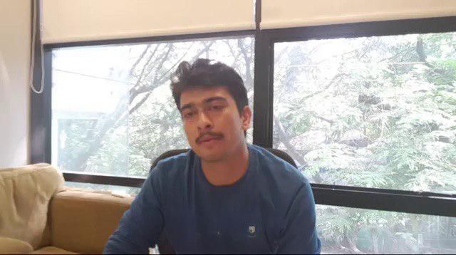
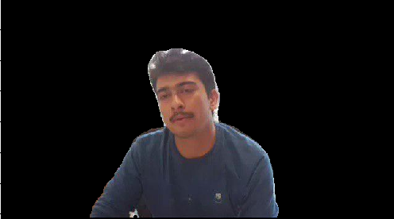
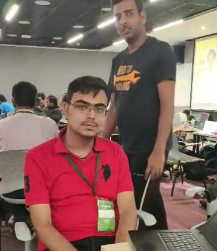

# Objective:
Use computer vision techniques to identify and remove background from a video stream in real time.

# How we tackled it:
We thoroughly researched the works in this field and came up with many different solutions that can solve the given challenge.
Following are the approaches we tried:

1. YOLACT: Real time instance segmentation [link](https://arxiv.org/pdf/1904.02689.pdf)
2. SIAM-MASK: Fast Online Object Tracking and Segmentation [link](https://arxiv.org/pdf/1812.05050.pdf)
3. BodyPix: Person Segmentation in the Browser [link](https://github.com/tensorflow/tfjs-models/tree/master/body-pix)
4. Mask-RCNN: Object Detection and Segmentation [link](https://arxiv.org/pdf/1703.06870.pdf)
5. DeepLabs: DeepLab: Semantic Image Segmentation with Deep Convolutional Nets, Atrous Convolution, and Fully Connected CRFs [link](https://arxiv.org/pdf/1606.00915.pdf)
6. Google AI: Mobile Real-time Video Segmentation [link](https://ai.googleblog.com/2018/03/mobile-real-time-video-segmentation.html)
7. GrabCut Algorithm: Interactive Foreground Extraction [link](https://opencv-python-tutroals.readthedocs.io/en/latest/py_tutorials/py_imgproc/py_grabcut/py_grabcut.html)

# Best Approachs:
### YOLACT: Real time instance segmentation
1. Fully-convolutional model for realtime instance segmentation that achieves 29.8 mAP on MS COCO at 33 fps evaluated on a single Titan Xp, which is significantly faster than any previous competitive approach.
2. Accomplish this by breaking instance segmentation into two parallel subtasks: (1) generating a set of prototype masks and (2) predicting per-instance mask coeffi-cients.
3. Then we produce instance masks by linearly combining the prototypes with the mask coefficients. We find that because this process doesn’t depend on repooling, this approach produces very high-quality masks and exhibits temporal stability for free.
4. Also propose Fast NMS, a drop-in 12 ms faster replacement for standard NMS that only has a marginal performance penalty
5. The processing speed is very fast for real time data extraction. On Titan Xp GPU, the results are:
Image Size: 550
Backbone model:	Resnet50-FPN
FPS: 42.5

### SiaMask: Fast Online Object Tracking and Segmentation
1. perform both visual object tracking and semi-supervised video object segmentation, in real-time, with a single simple approach.
2. SiamMask, improves the offline training procedure of popular fully-convolutional Siamese approaches for object tracking by augmenting their loss with a binary segmentation task.
3. SiamMask solely relies on a single bounding box initialisation and operates online, producing class-agnostic object segmentation masks and rotated bounding boxes at 55 frames per second.
4. Speed are tested on a NVIDIA RTX 2080.
FPS: 56

# Other Approaches:
### BodyPix: Person Segmentation in the Browser
This approach was requires GPU machine and the output was very slow fps.
### Mask-RCNN: Object Detection and Segmentation
This approach had decent accuracy but the processing time was very high, approx 14 seconds per frame, so it was not feasible for real time.
### DeepLabs: DeepLab: Semantic Image Segmentation with Deep Convolutional Nets, Atrous Convolution, and Fully Connected CRFs
This approach doesn't give high accuracy and the processing was also very slow.
### Google AI: Mobile Real-time Video Segmentation
The accuracy was not good in this approach.
### GrabCut Algorithm: Interactive Foreground Extraction
This approach required the bounding box to be detected for each frame and then process for foreground extraction, hence this was having low fps.

# Results:
## Input

## Output

## Input

## Output

